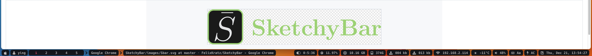

# [SketchyBar](https://github.com/FelixKratz/SketchyBar)



## Installation
- [Brew Install](https://felixkratz.github.io/SketchyBar/setup)
- Update `.config/yabai/yabairc`
  ```
  yabai -m config external_bar all:0:22
  ```

## Configuration
### Network plugin
- Install jq
  ```shell
  brew install jq
  ```
- Install ifstat
  ```shell
  brew install ifstat
  ```
- Find the correct network (command: ifstat) and update plugins `/plugins/network_down.sh` and `/plugins/network_up.sh` 
  ```
  # if the network is en1:
  UPDOWN=$(ifstat -i "en1" -b 0.1 1 | tail -n1)
  ```

## Commands
- start
  ```shell
  brew services start sketchybar
  ```
  ```shell
  sketchybar
  ```
- stop
  ```shell
  brew services stop sketchybar
  ```
- Restart
  ```shell
  brew services restart sketchybar
  ```

## Add/Rmove items
1. Go to file `sketchybar/sketchybarrc`
2. Comment or uncomment sources
  - For exampe, comment `source "$ITEM_DIR/clock.sh"` to remove date and time, like this
    ```shell
    # source "$ITEM_DIR/clock.sh"
    ```
3. Restart sketchybar
  ```shell
  brew services restart sketchybar
  ```